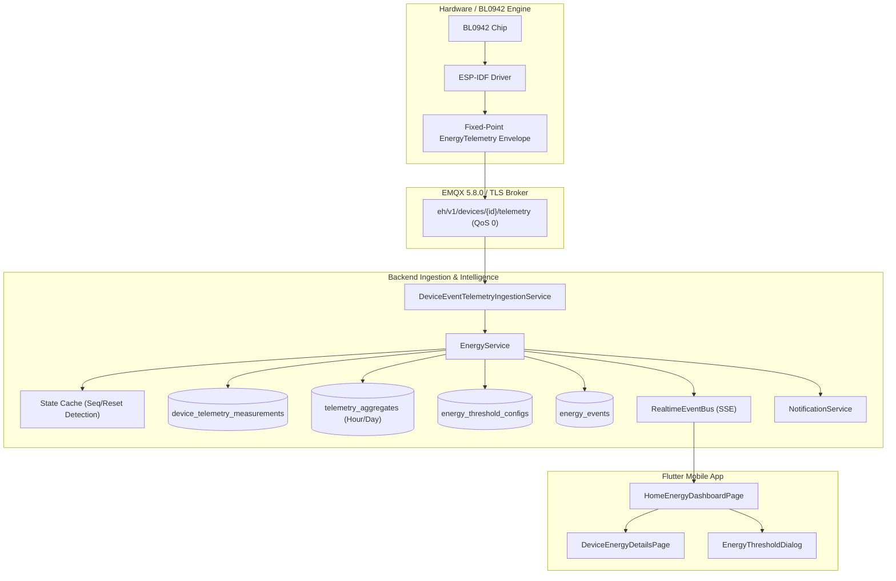

# EH Home — Phase 19 Energy Intelligence & Telemetry Analytics

## 1. Overview & Architecture

Phase 19 elevates EH Home's high-frequency electrical metering and hardware telemetry (BL0942 / HLW8032 / ADE7953) into an enterprise-grade energy intelligence platform. The architecture provides:
- **Authoritative Electrical Normalization**: Ingestion of fixed-point electrical metrics (`v_mv`, `i_ma`, `p_mw`, `e_tot_wh`, `e_int_mwh`, `freq_mhz`, `pf_x1000`) with bounded validation and unit conversion into standard SI metric units (V, A, W, kWh, Hz).
- **Monotonic & Reset Invariant Engine**: Handles device reboots, hardware counter rollovers, and sequence replays without aggregate corruption.
- **Multi-Resolution Aggregation**: Continuous incremental aggregation across hourly and daily time buckets with sample weighting, peak demand tracking, and quality annotations.
- **Hierarchical Analytics Engine**: Authoritative calculation of device-, room-, and home-level energy summaries, period-over-period comparisons, and tariff cost estimations.
- **Realtime Observability & Alerts**: High-power overload detection, daily budget threshold monitoring, SSE event dissemination, and unified push notification delivery.
- **Cross-Home Isolation & Zero Secret Leakage**: Rigorous capability-based authorization preventing cross-tenant leakage.

---

## 2. Fixed-Point Electrical Representation & Conversions

| Property | Wire Format | Scale Factor | Engineering Unit | Database Field |
| :--- | :--- | :--- | :--- | :--- |
| **Voltage** | `v_mv` (uint32) | $1 / 1000$ | Volts (V) | `v_mv` (INTEGER) |
| **Current** | `i_ma` (uint32) | $1 / 1000$ | Amperes (A) | `i_ma` (INTEGER) |
| **Active Power** | `p_mw` (uint32) | $1 / 1000$ | Watts (W) | `p_mw` (INTEGER) |
| **Cumulative Energy** | `e_tot_wh` (uint64) | $1 / 1000$ | Kilowatt-hours (kWh) | `e_tot_wh` (BIGINT) |
| **Interval Energy** | `e_int_mwh` (uint32) | $1 / 1000$ | Watt-hours (Wh) | `e_int_mwh` (INTEGER) |
| **Power Factor** | `pf_x1000` (uint16) | $1 / 1000$ | Dimensionless (0.00 – 1.00) | `pf_x1000` (INTEGER) |
| **Grid Frequency** | `freq_mhz` (uint32) | $1 / 1000$ | Hertz (Hz) | `freq_mhz` (INTEGER) |

---

## 3. Database Schema (Migration 012)

### `device_telemetry_measurements`
- `id` (VARCHAR(128) PRIMARY KEY)
- `device_id` (VARCHAR(64) NOT NULL REFERENCES devices(id))
- `channel_index` (INTEGER NOT NULL DEFAULT 1)
- `v_mv` (INTEGER NOT NULL)
- `i_ma` (INTEGER NOT NULL)
- `p_mw` (INTEGER NOT NULL)
- `e_tot_wh` (BIGINT NOT NULL)
- `e_int_mwh` (INTEGER)
- `freq_mhz` (INTEGER)
- `pf_x1000` (INTEGER)
- `flags` (INTEGER NOT NULL DEFAULT 0)
- `sequence_number` (BIGINT NOT NULL DEFAULT 0)
- `device_timestamp` (TIMESTAMP NOT NULL)
- `ingested_at` (TIMESTAMP NOT NULL)

### `telemetry_aggregates`
- `id` (VARCHAR(160) PRIMARY KEY)
- `device_id` (VARCHAR(64) NOT NULL REFERENCES devices(id))
- `channel_index` (INTEGER NOT NULL DEFAULT 1)
- `bucket_type` (VARCHAR(16) NOT NULL) — `MINUTE`, `HOUR`, `DAY`
- `bucket_start` (TIMESTAMP NOT NULL)
- `bucket_end` (TIMESTAMP NOT NULL)
- `total_energy_wh` (DOUBLE PRECISION NOT NULL)
- `avg_power_w` (DOUBLE PRECISION NOT NULL)
- `peak_power_w` (DOUBLE PRECISION NOT NULL)
- `min_power_w` (DOUBLE PRECISION NOT NULL DEFAULT 0.0)
- `sample_count` (INTEGER NOT NULL DEFAULT 1)
- `data_quality` (VARCHAR(16) NOT NULL DEFAULT 'GOOD')
- `created_at` (TIMESTAMP NOT NULL)
- `updated_at` (TIMESTAMP NOT NULL)

### `energy_threshold_configs`
- `id` (VARCHAR(128) PRIMARY KEY)
- `home_id` (VARCHAR(64) NOT NULL REFERENCES homes(id))
- `device_id` (VARCHAR(64) REFERENCES devices(id))
- `high_power_w` (DOUBLE PRECISION)
- `daily_energy_kwh` (DOUBLE PRECISION)
- `monthly_energy_kwh` (DOUBLE PRECISION)
- `cost_per_kwh` (DOUBLE PRECISION NOT NULL DEFAULT 0.15)
- `currency` (VARCHAR(8) NOT NULL DEFAULT 'USD')
- `is_enabled` (INTEGER NOT NULL DEFAULT 1)
- `created_at` (TIMESTAMP NOT NULL)
- `updated_at` (TIMESTAMP NOT NULL)

### `energy_events`
- `id` (VARCHAR(128) PRIMARY KEY)
- `home_id` (VARCHAR(64) NOT NULL REFERENCES homes(id))
- `device_id` (VARCHAR(64) REFERENCES devices(id))
- `event_type` (VARCHAR(64) NOT NULL) — `HIGH_POWER_EXCEEDED`, `DAILY_ENERGY_EXCEEDED`, `COUNTER_RESET`
- `severity` (VARCHAR(16) NOT NULL DEFAULT 'WARN')
- `value_recorded` (DOUBLE PRECISION NOT NULL)
- `threshold_value` (DOUBLE PRECISION NOT NULL)
- `message` (TEXT NOT NULL)
- `details_json` (TEXT)
- `created_at` (TIMESTAMP NOT NULL)

---

## 4. REST API Reference

| Method | Endpoint | Authorization | Description |
| :--- | :--- | :--- | :--- |
| `GET` | `/api/v1/energy/devices/:deviceId/latest` | `canViewHome` | Retrieves latest normalized electrical measurement. |
| `GET` | `/api/v1/energy/devices/:deviceId/history` | `canViewHome` | Paginated range query for historical telemetry readings. |
| `GET` | `/api/v1/energy/devices/:deviceId/summary` | `canViewHome` | Device energy summary for specified period (`today`, `week`, `month`, `year`). |
| `GET` | `/api/v1/energy/rooms/:roomId/summary` | `canViewHome` | Room energy aggregate and breakdown. |
| `GET` | `/api/v1/energy/homes/:homeId/summary` | `canViewHome` | Home energy summary with period-over-period comparison & tariff cost. |
| `GET` | `/api/v1/energy/homes/:homeId/trends` | `canViewHome` | Time-series trend points for graphing (hourly / daily intervals). |
| `GET` | `/api/v1/energy/homes/:homeId/top-consumers` | `canViewHome` | Top consuming devices and rooms with percentage of total load. |
| `GET` | `/api/v1/energy/homes/:homeId/thresholds` | `canViewHome` | Active energy thresholds and cost parameters. |
| `POST` | `/api/v1/energy/homes/:homeId/thresholds` | `canManageHome` | Upserts high-power limit, daily/monthly budgets, and tariff rate. |
| `GET` | `/api/v1/energy/homes/:homeId/events` | `canViewHome` | Anomaly, overload, and counter reset events log. |

---

## 5. Security & Privacy Guarantees

1. **Multi-Home Isolation**: All endpoints verify user home membership through `HomeAuthorizationService`. Attempting cross-tenant access returns `403 Forbidden`.
2. **Capability Access Control**: Threshold and budget mutations require `canManageHome` capability, preventing unauthorized changes by member-tier accounts.
3. **Secret Leakage Elimination**: Energy telemetry records, aggregates, summaries, and API payloads contain zero cryptographic credentials, session tokens, or private keys.
4. **Lifecycle Retention Policy**: Automated retention pruning purges raw high-frequency telemetry older than cutoff limits while preserving pre-aggregated summaries in `telemetry_aggregates`.
