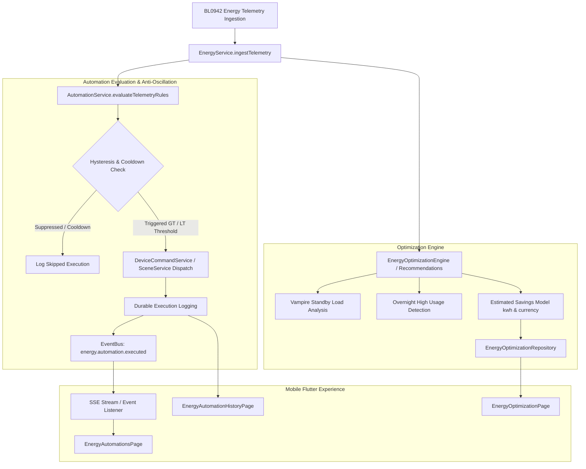

# Phase 20 — Smart Energy Automation & Optimization

## 1. Executive Summary

Phase 20 delivers the **Smart Energy Automation & Optimization Engine** for EH Home. Building directly on the foundation of Phase 19 (Energy Intelligence & Telemetry Analytics), Phase 20 enables users to transform continuous energy measurements into intelligent, closed-loop automations and actionable cost/energy optimization recommendations.

---

## 2. Architectural Overview

---

## 3. Data Contracts & Database Schema

### 3.1 Canonical Schema (`packages/contracts/energy/energy-automation.schema.json`)
- **`EnergyCondition`**: Evaluates `instantaneous_power` (W), `sustained_power` (W over duration), `daily_energy` (kWh), or `cumulative_energy` (kWh) against configurable operators (`GT`, `GTE`, `LT`, `LTE`, `EQ`). Supports time-of-day windows and device/room/home scopes.
- **`EnergyHysteresisConfig`**: Configures `recoveryThreshold` and `cooldownSeconds` to prevent switch oscillation and high-frequency actuation relay bounce.
- **`EnergyAction`**: Defines `device_command` (e.g. `setPower(false)`) or `trigger_scene` (e.g. `Eco Mode`) with execution delays.
- **`EnergyOptimization`**: Captures actionable recommendations (`VAMPIRE_STANDBY_POWER`, `HIGH_PEAK_CONSUMPTION`, `OFF_PEAK_SHIFT_OPPORTUNITY`, `OVERNIGHT_LOAD`) with evidence and estimated kWh/cost savings.

### 3.2 SQL Migrations (`backend/migrations/013_smart_energy_automation.sql`)
1. **`energy_automation_executions`**: Tracks every evaluation event (succeeded, skipped, failed), trigger reason, telemetry context snapshot, requested action, and latency.
2. **`energy_optimizations`**: Stores generated recommendations, estimated savings, evidence baseline, and dismissal state.

---

## 4. Key Engine Capabilities

### 4.1 Anti-Oscillation & Hysteresis
To prevent rapid flapping when power fluctuates near a setpoint:
- **Upper Threshold Trigger (GT)**: When power exceeds 1500W, the rule fires and transitions to triggered state (`isTriggered: true`).
- **Recovery Threshold**: The rule will not re-trigger until power drops below the configured recovery threshold (e.g., 1200W).
- **Cooldown Debounce**: Even after recovery, a minimum debounce duration (e.g., 60s) suppresses duplicate triggers.

### 4.2 Recursion & Loop Safeguard
Automations that trigger scenes or secondary devices could inadvertently create feedback loops. The engine enforces an execution chain depth limit (max depth 3) and detects cyclic automation IDs, automatically aborting with `skipReason: 'loop_detected'`.

### 4.3 Evidence-Based Optimization Estimation
Recommendations compute savings using current baseline metrics and configured tariffs:
- Monthly kWh = $\frac{\text{Baseline (W)} \times 24 \times 30.5}{1000}$
- Monthly Cost = $\text{Monthly kWh} \times \text{Tariff per kWh}$
- Every estimate explicitly carries `isEstimate: true`.

---

## 5. REST API Specifications

| Method | Endpoint | Description | Required RBAC |
|---|---|---|---|
| `GET` | `/api/v1/energy/automations?homeId=:homeId` | List energy automation rules | `canViewAutomations` |
| `POST` | `/api/v1/energy/automations` | Create new energy automation rule | `canManageAutomations` |
| `GET` | `/api/v1/energy/automations/:id` | Get rule details | `canViewAutomations` |
| `PUT` | `/api/v1/energy/automations/:id` | Update rule | `canManageAutomations` |
| `POST` | `/api/v1/energy/automations/:id/enable` | Enable automation rule | `canManageAutomations` |
| `POST` | `/api/v1/energy/automations/:id/disable` | Disable automation rule | `canManageAutomations` |
| `DELETE` | `/api/v1/energy/automations/:id` | Delete automation rule | `canManageAutomations` |
| `GET` | `/api/v1/energy/automations/:id/history` | Get durable execution audit history | `canViewAutomations` |
| `GET` | `/api/v1/energy/optimization?homeId=:homeId` | Get optimization summary & recommendations | `canViewAnalytics` |
| `POST` | `/api/v1/energy/optimization/:id/dismiss` | Dismiss an optimization recommendation | `canManageAutomations` |
| `POST` | `/api/v1/energy/automations/:id/evaluate` | Manually evaluate/test automation rule | `canExecuteAutomations` |

---

## 6. Flutter Mobile Client

The mobile client in `smart_home_application_v1` provides a responsive user interface:
- **`EnergyAutomationsPage`**: Lists active and disabled rules, with filter chips and an active optimization banner.
- **`EnergyAutomationEditorPage`**: Complete rule authoring interface with metric selector, condition builder, hysteresis/recovery threshold inputs, cooldown dropdown, and action builder.
- **`EnergyConditionBuilder` & `EnergyActionBuilder`**: Reusable component builders.
- **`EnergyOptimizationPage`**: Visual savings summary card with gradient cards and actionable recommendations.
- **`EnergyAutomationHistoryPage`**: Timeline of execution events, trigger reasons, duration in ms, and skip diagnostics.
