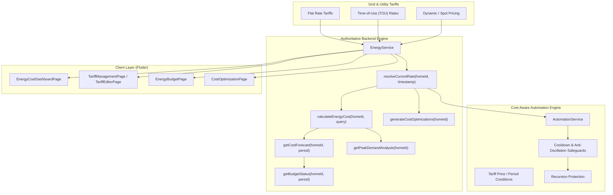

# EH Home Phase 21: Energy Cost Intelligence, Dynamic Tariffs & Cost Optimization

## Architecture & System Overview

Phase 21 extends Phase 19 Energy Intelligence and Phase 20 Smart Energy Automation into an authoritative, cost-aware energy intelligence and optimization engine for the EH Home platform.

---

## 1. Core Capabilities

### 1.1 Multi-Structure Electricity Tariffs
- **FLAT Rate:** Constant price per kWh (e.g. $0.15/kWh).
- **Time-of-Use (TOU):** Variable pricing by time window and day-of-week (e.g. Peak @ $0.32, Off-Peak @ $0.08, Standard @ $0.16).
  - Handles **overnight windows** seamlessly (e.g. `22:00` to `06:00` spanning across midnight boundaries).
- **Historical Tariff Tracking:** `effectiveFrom` and `effectiveTo` temporal boundaries isolate historical energy data calculations from subsequent rate revisions.
- **Fixed Daily Charges & Carbon Intensity:** Grid standing charges ($/day) and carbon intensity ($g\,\text{CO}_2/\text{kWh}$) integrated into cost summaries.

### 1.2 Authoritative Cost Calculation Engine
- Evaluates aggregate telemetry energy against active tariff rate windows.
- Deconstructs usage and expenditure into `peak`, `offPeak`, and `standard` buckets.
- Produces deterministic, non-speculative cost audits with quality indicators (`GOOD` / `PARTIAL`).

### 1.3 Cost Forecasting & Energy Budgeting
- **Monthly Run-Rate Projection:** Computes daily average expenditure to date and projects total period expenditure with confidence scoring.
- **Budget Tracking & Alerting:** Monitors budget consumption thresholds (e.g. 80%) and triggers proactive push notifications and realtime SSE events before end-of-cycle overruns occur.

### 1.4 Cheapest Period Analysis & Load Shifting
- Sliding window scanner determines the optimal consecutive hour window (e.g. 2-hour window in next 24h) for high-load device operations (EV charging, heat pumps, laundry).
- Quantifies cost reduction percentages compared to peak operational windows.

### 1.5 Cost-Aware Automation Engine
- Automation trigger conditions support:
  - `tariff_price` / `price` (e.g. price > $0.25/kWh)
  - `tariff_period` (e.g. period == `PEAK` or `OFF_PEAK`)
  - `estimated_daily_cost` / `cost_forecast`
- Enforces strict anti-oscillation safeguards, sustained power tracking, cooldown timers, hysteresis, and recursion depth limits.

---

## 2. Database Schema (Migration 014)

1. `energy_tariffs`: Stores tariff metadata, currency, flat rates, fixed charges, and validity intervals.
2. `tariff_periods`: Stores TOU pricing windows, weekday bitmasks/lists, and period classifications.
3. `energy_budgets`: Stores configured spending limits, period types, and alert thresholds.
4. `cost_optimizations`: Stores generated load-shifting recommendations and dismissal states.

---

## 3. API Surface

| Method | Endpoint | Description |
|---|---|---|
| `GET` | `/api/v1/energy/homes/:homeId/tariffs` | List all tariffs for home |
| `POST` | `/api/v1/energy/homes/:homeId/tariffs` | Create tariff plan (Owner/Admin) |
| `GET` | `/api/v1/energy/homes/:homeId/tariffs/:tariffId` | Get tariff by ID |
| `PUT` | `/api/v1/energy/homes/:homeId/tariffs/:tariffId` | Update tariff plan |
| `DELETE` | `/api/v1/energy/homes/:homeId/tariffs/:tariffId` | Delete tariff |
| `GET` | `/api/v1/energy/homes/:homeId/cost` | Authoritative energy cost calculation |
| `GET` | `/api/v1/energy/homes/:homeId/cost/forecast` | Period cost forecast & projection |
| `GET` | `/api/v1/energy/homes/:homeId/budget` | Budget status & overrun evaluation |
| `POST` | `/api/v1/energy/homes/:homeId/budget` | Create/update energy spending budget |
| `GET` | `/api/v1/energy/homes/:homeId/optimization/cheapest-periods` | Identify lowest-rate operating windows |
| `GET` | `/api/v1/energy/homes/:homeId/optimization/cost` | Retrieve load shifting recommendations |
| `POST` | `/api/v1/energy/optimization/cost/:id/dismiss` | Dismiss optimization recommendation |
| `GET` | `/api/v1/energy/homes/:homeId/carbon` | Grid carbon footprint estimation |

---

## 4. Physical Hardware Impact

**Physical Hardware Changes: NONE**
Phase 21 operates on top of Phase 19/20 telemetry and power metrics reported by firmware without requiring modifications to microcontroller firmware or hardware schematics.
