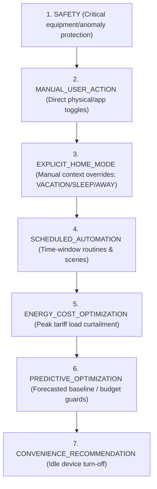

# EH Home — Phase 24: Smart Home Intelligence + Unified Decision Engine

## Architectural Overview
Phase 24 establishes an explainable, deterministic orchestration and decision layer positioned above all authoritative EH Home subsystems (Device Management, Presence, Context Precedence, Energy Intelligence, Tariffs, Forecasts, Anomalies, Schedules, and Automations).

The unified decision engine synthesizes multi-dimensional telemetry, presence, context, and financial signals into:
1. **Authoritative Summarized Unified Snapshots**: `HomeIntelligenceSnapshot`
2. **Prioritized Explainable Decisions**: `IntelligenceDecision`
3. **Actionable Recommendations**: `IntelligenceRecommendation`
4. **Safety-Gated Auto-Execution**: Automatic dispatch of low-risk, verified actions
5. **Auditable Outcome Tracking**: `DecisionOutcome`

---

## Decision Priority Hierarchy

The decision engine enforces a strict 7-tier precedence hierarchy:

A lower-priority decision or automation is strictly prohibited from overriding a higher-priority active state or active user cooldown.

---

## Deterministic Rule Engine & Recommendation Types

| Recommendation Type | Evaluation Triggers | Priority | Risk | Default Auto-Execution |
|---|---|---|---|---|
| `TURN_OFF_UNUSED_DEVICE` | Home/Presence is `AWAY` & active device drawing power | `CONVENIENCE_RECOMMENDATION` (7) | `LOW` | **Eligible** |
| `SHIFT_LOAD_TO_CHEAPER_PERIOD` | Tariff is `PEAK` & load > 500W | `ENERGY_COST_OPTIMIZATION` (5) | `MEDIUM` | User Approval |
| `REDUCE_PEAK_LOAD` | Peak demand forecast exceeds breaker threshold | `ENERGY_COST_OPTIMIZATION` (5) | `HIGH` | User Approval |
| `INVESTIGATE_ANOMALY` | Active power spike or telemetry anomaly detected | `SAFETY` (1) | `HIGH` | User Approval |
| `CHANGE_HOME_MODE` | Presence is `AWAY` but Context is `HOME` | `EXPLICIT_HOME_MODE` (3) | `LOW` | **Eligible** |
| `OPTIMIZE_AUTOMATION` | Predicted budget overrun or schedule conflict | `PREDICTIVE_OPTIMIZATION` (6) | `LOW` | User Approval |
| `REDUCE_STANDBY` | Baseline standby power elevated during vacation | `ENERGY_COST_OPTIMIZATION` (5) | `LOW` | User Approval |

---

## Safe Auto-Execution & Anti-Fighting Guards

Autonomous execution requires satisfying all of the following conditions:
1. **Risk Level**: Must be `LOW`.
2. **Auto-Execution Flag**: `isAutoExecutable: true`.
3. **Priority Precedence**: No active higher-priority override or automation conflict.
4. **Manual Command Priority Cooldown**: Target device must not have received a manual user command in the preceding 5 minutes (300 seconds).
5. **Transport Authorization**: Dispatched exclusively through authoritative `DeviceCommandService` or `ContextService`.

---

## Data Model & REST Endpoints

### Canonical Entities
- `intelligence_decisions`
- `intelligence_recommendations`
- `intelligence_decision_outcomes`

### REST API Surface
- `GET /api/v1/intelligence/homes/:homeId/summary`
- `GET /api/v1/intelligence/homes/:homeId/recommendations`
- `GET /api/v1/intelligence/homes/:homeId/decisions`
- `GET /api/v1/intelligence/homes/:homeId/decisions/:id`
- `POST /api/v1/intelligence/homes/:homeId/recommendations/:id/accept`
- `POST /api/v1/intelligence/homes/:homeId/recommendations/:id/reject`
- `POST /api/v1/intelligence/homes/:homeId/decisions/:id/execute`
- `POST /api/v1/intelligence/homes/:homeId/evaluate`
- `POST /api/v1/intelligence/homes/:homeId/auto-execute`
- `GET /api/v1/intelligence/homes/:homeId/history`
