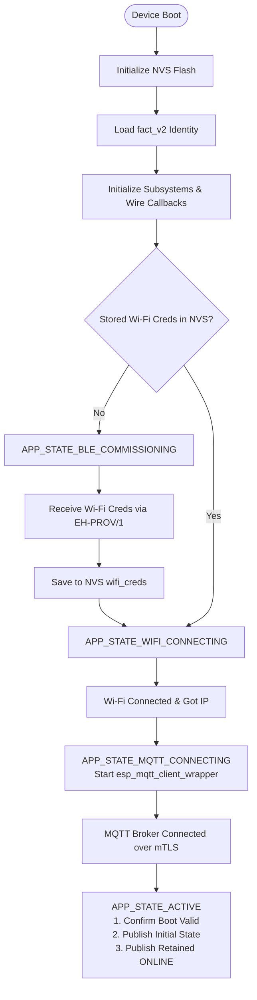

# Phase 35 — Firmware End-to-End MQTT, Persistence & OTA

- **Status:** `COMPLETE`
- **Date:** 2026-09-06
- **Target Target MCUs:** ESP32-C6 / ESP32-C3 / ESP32
- **Components:** `firmware/platforms/esp32/smart-switch-app`, `firmware/platforms/esp32/mqtt_client`, `firmware/common`

---

## 1. Overview

Phase 35 completes the production smart-switch firmware pipeline for the ESP32 platform, integrating:
- **Wi-Fi NVS Credential Persistence & Boot Recovery:** Credentials provisioned via BLE (EH-PROV/1) are committed to the `wifi_creds` NVS namespace and reloaded on reboot without logging secrets.
- **Factory Identity Preservation:** Device identity (`fact_v2`) remains immutable across Wi-Fi reset and re-commissioning.
- **Canonical mTLS MQTT Client Integration:** Full lifecycle integration into `main.c` with mTLS over port 8883, strict single-namespace topic hierarchy (`eh/v1/devices/{deviceId}/{category}`), LWT `OFFLINE`, and retained `ONLINE` availability.
- **Cloud Command Dispatch & Idempotency:** Command envelope validation, channel bounds checking (1..3), action parsing (`setPower`), and 32-entry idempotency ring buffer.
- **Authoritative Actual State & Event Publication:** Multi-channel state publication (`eh/v1/devices/{deviceId}/state`) and physical switch override event emission (`eh/v1/devices/{deviceId}/events`).
- **Fixed-Point BL0942 Telemetry:** Unsigned fixed-point energy telemetry (`v_mv`, `i_ma`, `p_mw`, `e_tot_wh`, `freq_mhz`, `pf_x1000`) published via QoS 0.
- **Offline Local Control:** Relays and physical switches remain 100% locally controllable when MQTT / Wi-Fi is disconnected.
- **Secure HTTPS OTA:** Dual-slot OTA using `esp_https_ota`, image bounds verification (<= 1792KB), SHA-256 integrity, Ed25519 signature checks, and anti-rollback protection.

---

## 2. Architecture & Boot Flow

---

## 3. MQTT Topic Hierarchy & Contract Compliance

All topics strictly follow the frozen single-namespace contract:

| Category | Direction | QoS | Retain | Payload Contract |
|---|---|---|---|---|
| `commands` | Backend → Device | 1 | `false` | `Command` (UUID, channel 1..3, `setPower`, idempotencyKey) |
| `command-receipts` | Device → Backend | 1 | `false` | `CommandReceipt` (`APPLIED`, `FAILED`, `EXPIRED`, `OVERRIDDEN`) |
| `state` | Device → Backend | 1 | `false` | `DeviceState` (all channels boolean power) |
| `events` | Device → Backend | 1 | `false` | `DeviceEvent` (`switch.changed`, `PHYSICAL_SWITCH`) |
| `telemetry` | Device → Backend | 0 | `false` | `EnergyTelemetry` (fixed-point BL0942 data) |
| `availability` | Device → Backend | 1 | `true` | `"ONLINE"` / `"OFFLINE"` (LWT) |

---

## 4. Physical Switch Authority & Offline Resilience

- **Local Actuation:** Flip of physical wall switch triggers GPIO interrupt and 50ms debounce logic, immediately actuating relay GPIO without awaiting network or cloud roundtrips.
- **State Reporting:** When MQTT is connected, state is published. If MQTT is offline, local relay control and energy telemetry acquisition continue uninterrupted.
- **Cloud Override Safety:** Newer physical switch actions take precedence over older in-flight cloud commands.

---

## 5. HTTPS OTA Security Specifications

- **Transport:** HTTPS mandatory (TLS certificate validated).
- **Anti-Rollback:** Target semver must be >= running semver (`ota_semver_compare`).
- **Minimum Version Requirement:** Running version must meet `minFirmwareVersion`.
- **Partition Bounds:** Binary size <= 1,792 KB (`ota_0` / `ota_1` partition limits).
- **Integrity & Authenticity:** 64-character SHA-256 digest and 128-character Ed25519 signature verified prior to flashing and reboot.
- **Boot Confirmation:** `ota_manager_confirm_boot_valid()` marks boot image valid after successful Wi-Fi + MQTT connection, preventing bootloader automatic rollback.
